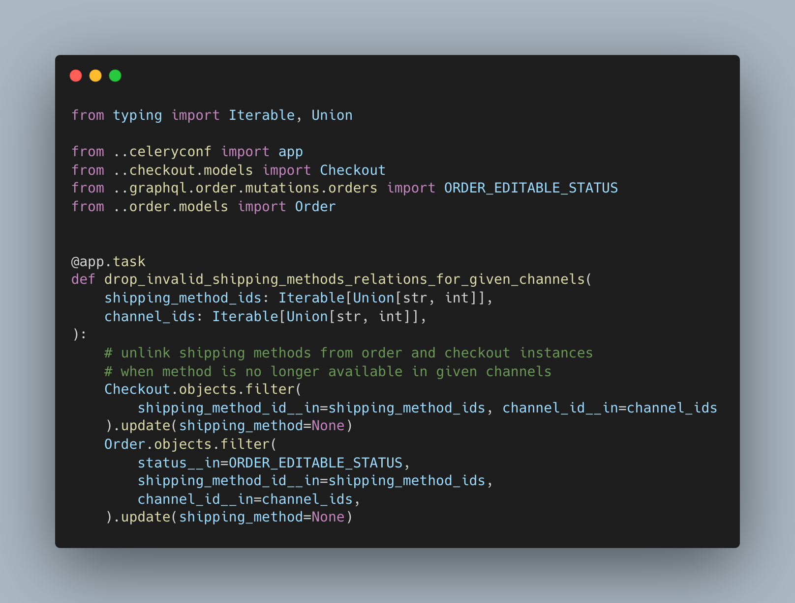
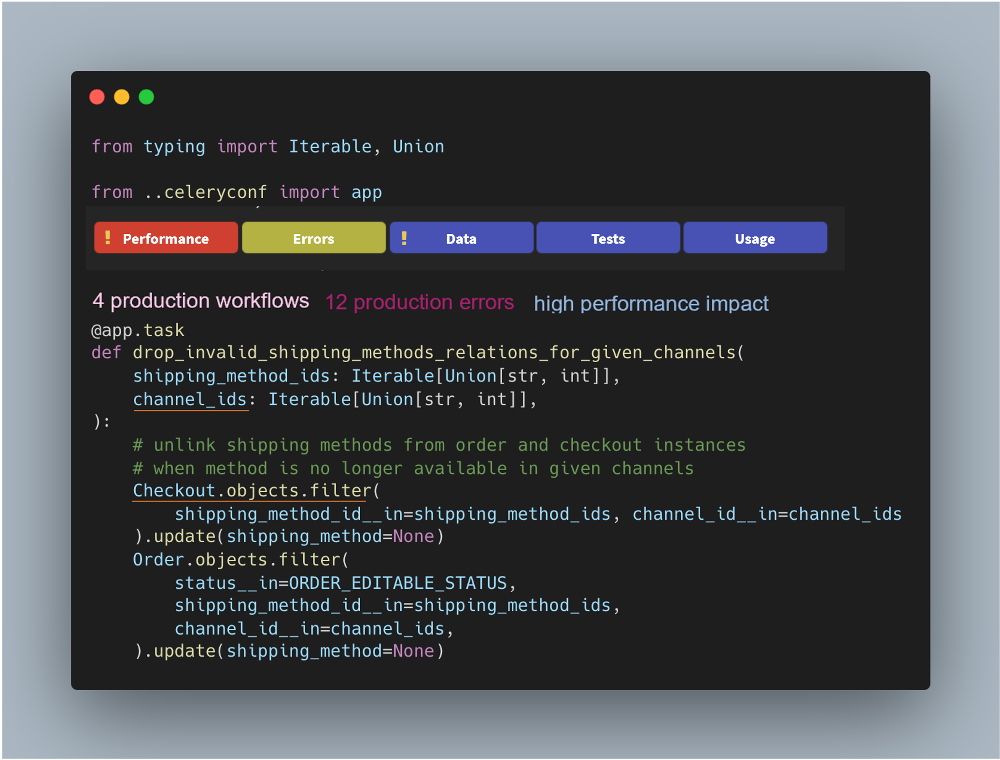
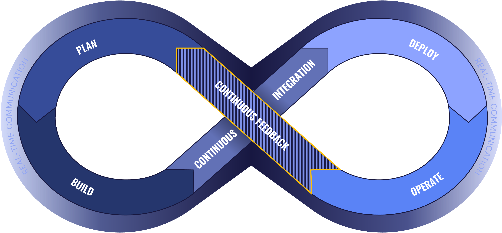

<!-- Place this tag in your head or just before your close body tag. -->

# What is Digma and why are we building it?	

## Digma is about *Developer Observability*

We believe that understanding code real-world requirements and behavior is critical to making better software. Something that can be done only if we connect the dots between design time and runtime.

There are many observability tools out there, they all take a very monitoring centric - 'live events capture' approach to observabilty. We feel they have managed to miss what developers care about when writing their code :computer:	. 

Our goal is to create an **open platform** for interpreting and analyzing the information collected via observablity. Traces, logs, metrics are great! But additional effort is needed in order to take them that last mile into the development process.

## The Digma way: :bat:

So how do we do that? How do we make observability relevant? Digma has three main design principles that we think are key in unlocking the potentional of observablity data.

> **Code Insights and analytics** *over* **raw data**

Because if it takes time and manual work to check aggregate  correlate and understand the significance of raw logs and traces you'll probably not do it a lot :beach_umbrella:	
> **Proactive** *over* **reactive**

Otherwise you won't know what to look for unless its already on  :fire:

> **Integrated** *over* **external** 

Because context switching is already an issue. Going back and forth between dashborts and :chart: is guaranteed to slow you down. 
## :gear: How does Digma work?

It is a pipeline. A continuous feedback pipeline that injects data from your observability :telescope: sources and generates feedback.

## How are you different from...

Well we don't compete with any tool existing today because... There isn't any tool that aims to generate this type of feedback. We do work very well together with other tools looking at the same data, like Jaeger, Prometheus, even traditional observability tools like Datadog or Splunk. 

At the time of this writing, most of the data Digma collects is OpenTelemetry based. In the future we will definitely be able to injest data from other technologies as well such as eBPF or even CloudWatch.

## Can you give me some examples?

Sure! Think about any piece of code in your IDE. In fact, lets take this random snippet I came across exploring Github: [Source Here](https://github.com/saleor/saleor/blob/main/saleor/shipping/tasks.py).

Looking at the above call we can infer a lot about what it does but not so much about
**how it is used**

With *Developer Observability* we can use existing logs, traces and metrics to answer questions such as:

* Where is this function called from, is it even used
* What data is passed into its parameters in runtime? 
* What type of errors does it raise in runtime, under which conditions, and how do they impact the final end user

More important we can start correlating all of these data points. Does the performance of this function scale differently for different shipping methods? How is all of this information trending between releases, commits, types of users?  

 
 

## Digma is about Continuous Feedback

There are countless of CI/CD platforms out there, but almost no tool to provide feedback back from prod and test to the code.

With continuous feedback we can make code changes and design that are well informed on actual usage and real world expectations. 

 
 

## How can I learn more about Digma?

We started publishing some more detailed blog posts explaining what we are trying to accomplish:

[CI-CD-CF The Devops Toolchain Missing Link](https://levelup.gitconnected.com/ci-cd-cf-the-devops-toolchains-missing-link-b5c88caf6282)

[Breaking the Fourth Wall in Coding](https://levelup.gitconnected.com/breaking-the-fourth-wall-in-coding-189055955c85)

 
 

## How do I contribute

### Consider starring this repo - it helps us know you care!

### Join our community

We are still debating where we want to host our community and which platform to use. In the meanwhile, if you want to get involved in the discussion please message us at community@digma.ai and we'll be happy to include you in some of our early discussion forums.

### Join as a contributor

We'll be releasing some of our Open Source code repos soon - still working on tidying things up. We welcome you as a contributer!

At the heart of Digma's datamodel are three main entities over which the platform aggregates data: 

* **Code Objects**, these are your functions and classes, as well as specific elements referenced within the code. 
* **Flows** These are groups or clusters of traces that represent ways the code objects are used together
* **Commits** and release history

